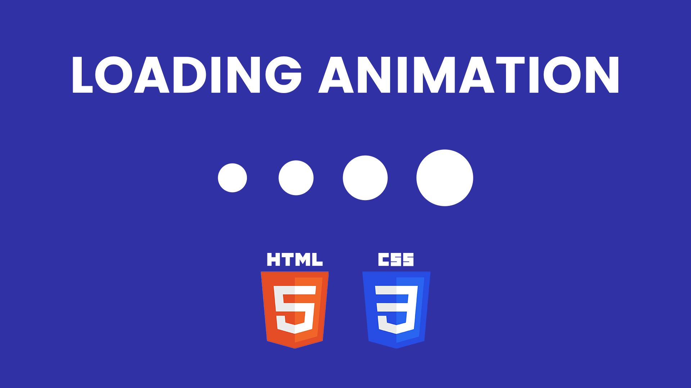

# Dynamic Loading Animation in HTML CSS | Unleash Your Creativity with CSS3

The Dynamic Loading Animation tutorial teaches you how to create captivating loading animations using only HTML and CSS. This project emphasizes leveraging CSS3's advanced capabilities to design dynamic and visually engaging loading effects.

Youtube Tutorial Link: https://youtu.be/n_t5ayGZI8I

By exploring key CSS3 properties such as keyframes, animations, and transforms, you will learn to craft unique and creative loading animations that enhance the user experience during content load times. This tutorial is perfect for developers looking to add a touch of creativity and polish to their web projects, making the wait for content more enjoyable and visually appealing.
